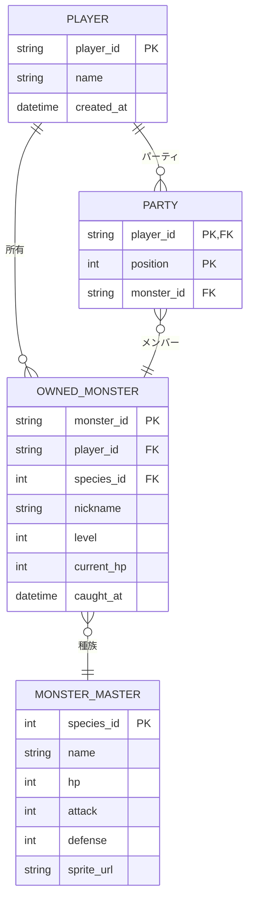
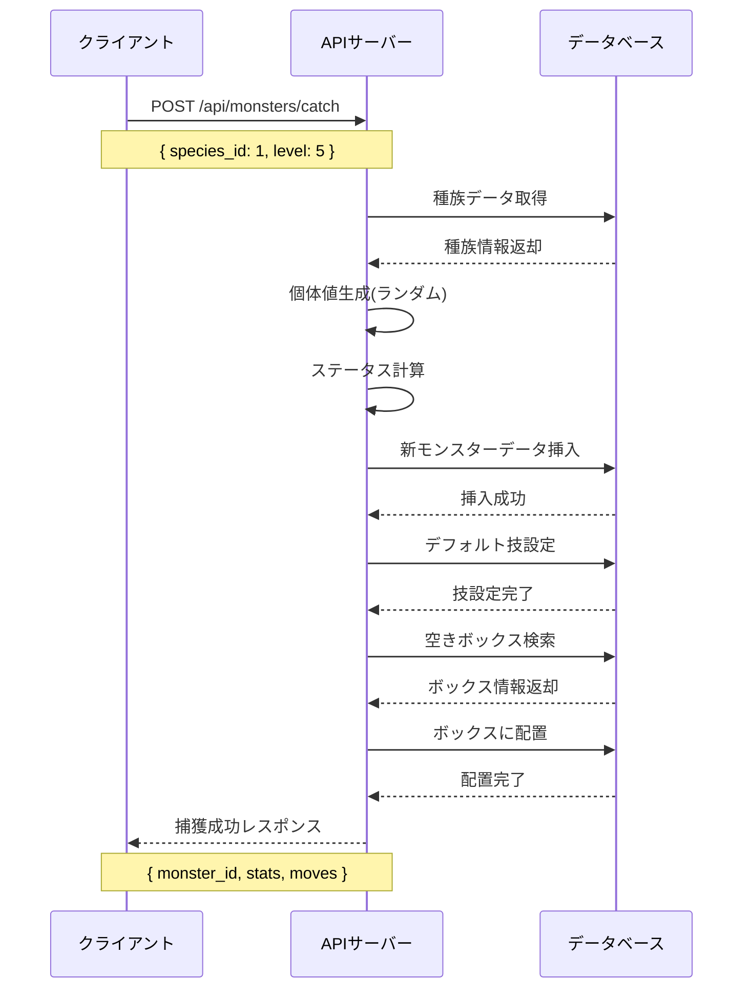
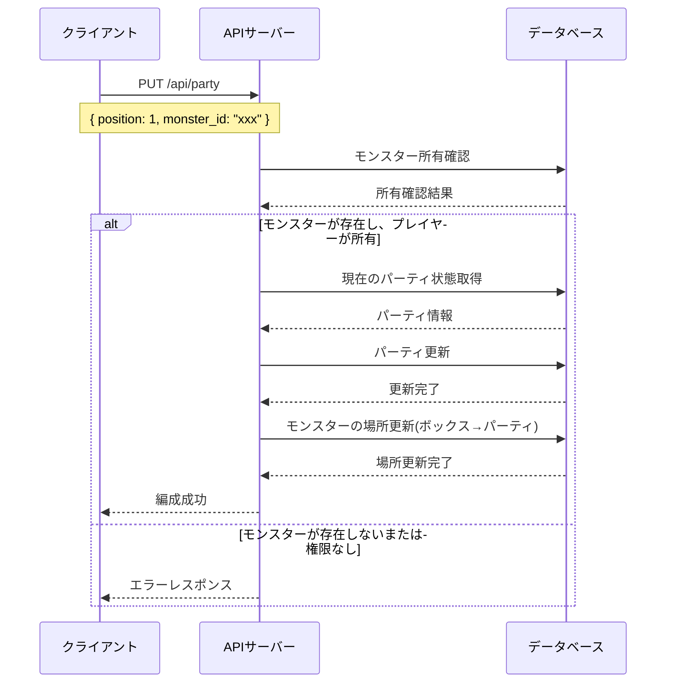

# モンスター管理システム設計書

## 概要

モンスター収集型ゲームにおけるモンスターの捕獲、育成、パーティ編成を管理するシステムの設計書です。
初学者向けのプロジェクトとして、学習効果を重視したシンプルで理解しやすい設計を採用します。

## システム要件

### 機能要件（シンプル版）

1. **モンスターデータ管理**

   - モンスターの基本情報（名前、レベル、HP）の管理
   - シンプルなステータス（HP、攻撃、防御のみ）

2. **パーティ編成**

   - 手持ちモンスターの管理（最大6体）
   - パーティメンバーの並び替え

3. **基本的なモンスター操作**
   - モンスター捕獲機能
   - モンスター一覧表示
   - ニックネーム設定

### 非機能要件

1. **パフォーマンス**

   - ポケモンリストの高速表示
   - 大量データの効率的な管理

2. **ユーザビリティ**

   - 直感的なUI/UX
   - ドラッグ&ドロップによる操作

3. **拡張性**
   - 新しいモンスター種族の追加容易性
   - 新機能の追加を考慮した設計

## データベース設計（シンプル版）

### ER図



### テーブル設計の詳細（シンプル版）

#### 1. PLAYER（プレイヤー）

- プレイヤーの基本情報のみ管理
- 所持金などの複雑な要素は省略

#### 2. MONSTER_MASTER（モンスターマスタデータ）

- モンスターの種族基本データ
- HP、攻撃力、防御力のみの簡単なステータス
- タイプや特殊能力は省略

#### 3. OWNED_MONSTER（所有モンスター）

- プレイヤーが捕まえたモンスターの個体データ
- レベルと現在HPのみ管理
- 個体値、性格、経験値などの複雑な要素は省略

#### 4. PARTY（パーティ）

- 手持ちモンスター（最大6体）の並び順を管理
- ボックスシステムは省略し、すべてのモンスターは常に利用可能

## API設計

### RESTful API エンドポイント

#### モンスター管理（シンプル版）

```
GET    /api/monsters/owned          # 所有モンスター一覧取得
POST   /api/monsters/catch          # モンスター捕獲
GET    /api/monsters/owned/{id}     # 特定モンスター詳細取得
PUT    /api/monsters/owned/{id}     # モンスター情報更新（ニックネーム等）

GET    /api/monsters/species        # 種族データ一覧
```

#### パーティ管理

```
GET    /api/party                   # パーティ取得
PUT    /api/party                   # パーティ編成更新
```

### APIシーケンス図

#### モンスター捕獲フロー



#### パーティ編成フロー



## 実装フェーズ

### Phase 1: データベーススキーマ作成

1. マイグレーションファイル作成
2. 基本テーブル定義
3. インデックス設定
4. 制約設定

### Phase 2: 基本CRUD API実装

1. モンスター種族データAPI
2. 所有モンスターCRUD
3. パーティ管理API
4. ボックス管理API

### Phase 3: 高度な機能実装

1. レベルアップシステム
2. 技習得システム
3. ステータス計算エンジン
4. 経験値計算

### Phase 4: フロントエンド統合

1. モンスター一覧画面
2. パーティ編成画面
3. ボックス管理画面
4. モンスター詳細画面

## 学習ポイント

### 初学者向け学習要素

1. **データベース設計**

   - 正規化の概念
   - リレーションシップの設計
   - インデックスの重要性

2. **REST API設計**

   - RESTful設計原則
   - HTTP ステータスコードの適切な使用
   - APIドキュメンテーション

3. **TypeScript活用**

   - 型安全なAPI開発
   - インターフェース設計
   - ジェネリクスの活用

4. **複雑なビジネスロジック**

   - ステータス計算アルゴリズム
   - レベルアップ処理
   - データ整合性の保証

5. **パフォーマンス最適化**
   - クエリ最適化
   - ページネーション
   - キャッシュ戦略

## 次のステップ

このドキュメントの承認後、以下の順序で実装を進めます：

1. データベースマイグレーション作成
2. 型定義ファイル作成
3. 基本CRUD操作の実装
4. テストの実装
5. API統合テスト

各実装ステップでは、TDD（テスト駆動開発）を採用し、
初学者が理解しやすいよう詳細なコメントとドキュメントを併記します。
