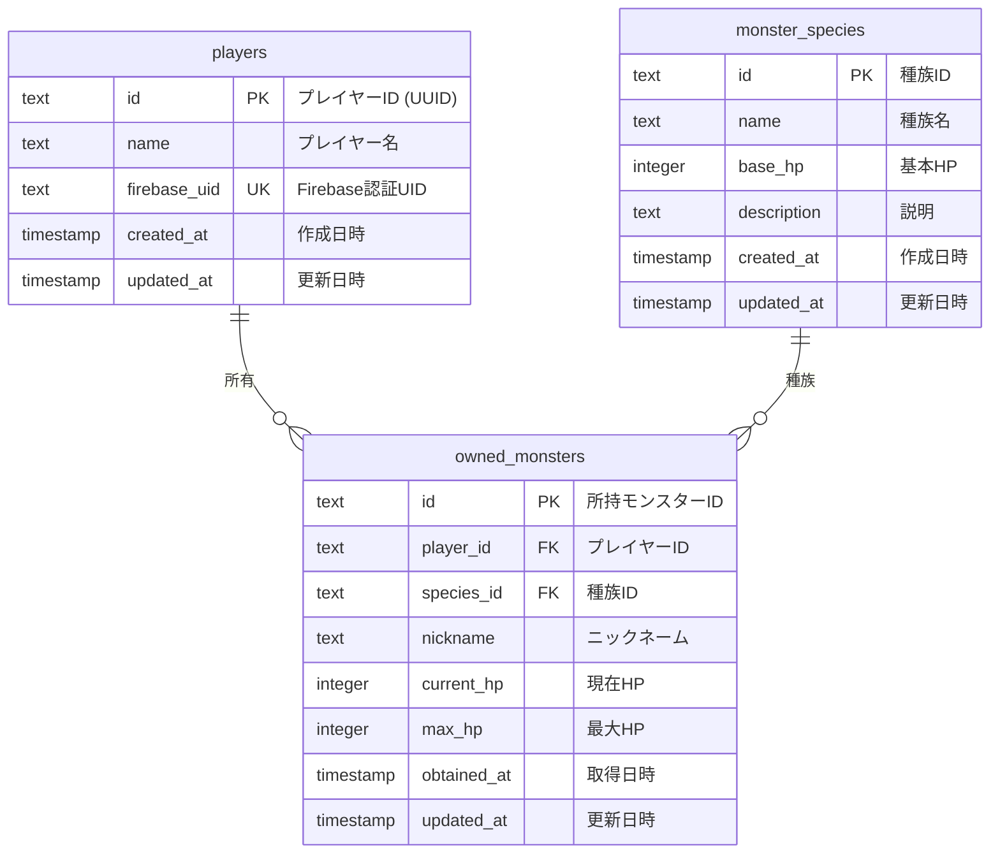

# データベースER図

## 概要
モンスター収集ゲームのデータベース構造を表すER図です。

## ER図

## テーブル詳細

### 1. players（プレイヤー）
- **目的**: ゲームプレイヤーの基本情報を管理
- **主キー**: `id` (UUID形式)
- **ユニークキー**: `firebase_uid` (Firebase認証との連携用)
- **特記事項**: 
  - 現在のデータではすべての`firebase_uid`が"null"になっている問題あり
  - Firebase認証と正しく連携していない

### 2. monster_species（モンスター種族）
- **目的**: モンスターの種族マスターデータ
- **主キー**: `id`
- **データ例**:
  - でんきネズミ (base_hp: 35)
  - ほのおトカゲ (base_hp: 40)
  - くさモグラ (base_hp: 30)

### 3. owned_monsters（所持モンスター）
- **目的**: プレイヤーが所有する個々のモンスターを管理
- **主キー**: `id`
- **外部キー**: 
  - `player_id` → `players.id`
  - `species_id` → `monster_species.id`
- **特記事項**: 
  - 同じ種族でも個体ごとに異なるデータ（ニックネーム、HP等）を持つ
  - プレイヤー作成時に初期モンスター1体が自動付与される

## 現在の問題点

1. **Firebase認証との連携不足**
   - `players.firebase_uid`がすべて"null"
   - 認証済みユーザーとプレイヤーデータが紐づいていない

2. **データ整合性**
   - プレイヤー作成APIがデータベースに保存していない
   - Firebase UIDでプレイヤーを検索できない

3. **影響**
   - ログイン済みユーザーも毎回プレイヤー作成画面に遷移
   - 所持モンスターの取得時にプレイヤーが見つからない

## リレーションシップ

- **players : owned_monsters = 1 : N**
  - 1人のプレイヤーは複数のモンスターを所有できる
  
- **monster_species : owned_monsters = 1 : N**
  - 1つの種族に対して複数の個体が存在できる

## インデックス（推奨）

1. `players.firebase_uid` - ユニークインデックス
2. `owned_monsters.player_id` - 外部キーインデックス
3. `owned_monsters.species_id` - 外部キーインデックス
4. `owned_monsters.obtained_at` - ソート用インデックス