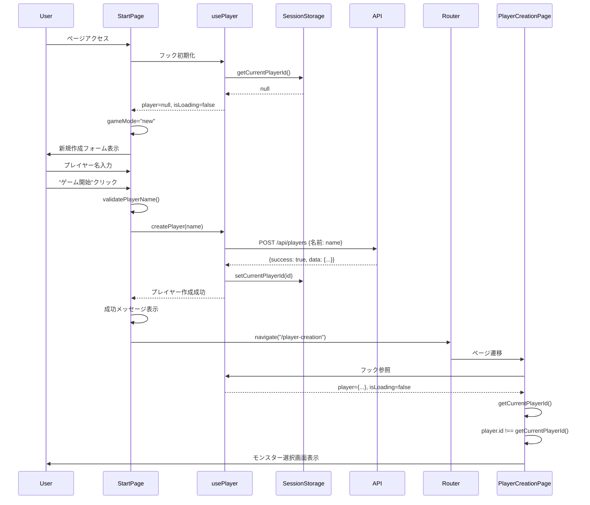
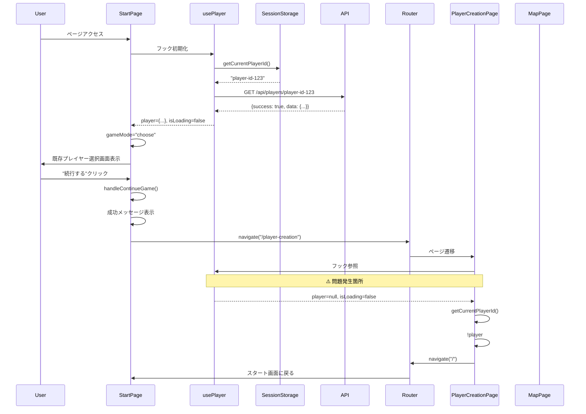
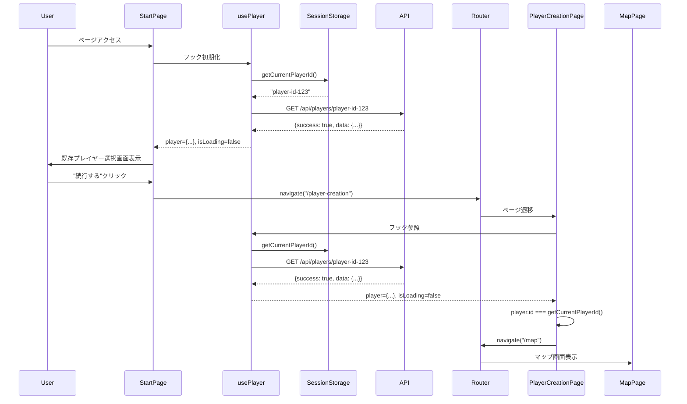

# 画面遷移処理フロー実装分析

このドキュメントでは、モンスター収集ゲームのフロントエンド画面遷移処理の実装を詳細に分析し、現在の問題点と解決策を明確化します。

## 全体のルーティング構造

### ルート定義 (App.tsx)

```typescript
<Routes>
  <Route path="/" element={<StartPage />} />
  <Route path="/player-creation" element={<PlayerCreationPage />} />
  <Route path="/map" element={<MapPage />} />
  <Route path="/monsters" element={<MonsterListPage />} />
  <Route path="/battle" element={<BattlePage />} />
  <Route path="*" element={<StartPage />} />
</Routes>
```

## 包括的な画面遷移フロー

```mermaid
flowchart TD
    Start["スタート画面<br/>(StartPage)"] --> CheckSession{"SessionStorageに<br/>プレイヤーID存在？"}
    
    CheckSession -->|"存在する"| LoadPlayer["usePlayerフックで<br/>プレイヤー情報取得"]
    CheckSession -->|"存在しない"| ShowNewForm["新規作成フォーム表示"]
    
    LoadPlayer --> PlayerLoaded{"プレイヤー情報<br/>取得成功？"}
    PlayerLoaded -->|"成功"| ShowChoice["選択画面表示<br/>(既存 vs 新規)"]
    PlayerLoaded -->|"失敗(404)"| ClearSession["SessionStorageクリア"]
    
    ClearSession --> ShowNewForm
    
    ShowChoice --> ContinueBtn["続行するボタン"]
    ShowChoice --> NewBtn["新規作成ボタン"]
    
    NewBtn --> ShowNewForm
    ContinueBtn --> SetContinueMsg["成功メッセージ表示"]
    SetContinueMsg --> NavToCreation1["navigate('/player-creation')"]
    
    ShowNewForm --> InputName["プレイヤー名入力"]
    InputName --> ValidateName{"プレイヤー名<br/>バリデーション"}
    ValidateName -->|"無効"| ShowError["エラーメッセージ表示"]
    ValidateName -->|"有効"| CreatePlayer["createPlayerAPI呼び出し"]
    
    ShowError --> InputName
    CreatePlayer --> APISuccess{"API呼び出し<br/>成功？"}
    APISuccess -->|"失敗"| ShowAPIError["APIエラー表示"]
    APISuccess -->|"成功"| SaveSession["SessionStorageに<br/>プレイヤーID保存"]
    
    ShowAPIError --> InputName
    SaveSession --> SetSuccessMsg["成功メッセージ表示"]
    SetSuccessMsg --> NavToCreation2["navigate('/player-creation')"]
    
    NavToCreation1 --> PlayerCreation["プレイヤー作成画面<br/>(PlayerCreationPage)"]
    NavToCreation2 --> PlayerCreation
    
    PlayerCreation --> CheckPlayer{"プレイヤー情報<br/>存在？"}
    CheckPlayer -->|"なし"| BackToStart["navigate('/')"]
    CheckPlayer -->|"あり"| CheckExisting{"既存プレイヤー？<br/>getCurrentPlayerId()確認"}
    
    CheckExisting -->|"既存 (ID一致)"| AutoNavToMap["自動でnavigate('/map')"]
    CheckExisting -->|"新規 (ID不一致)"| ShowMonsterSelect["モンスター選択画面表示"]
    
    ShowMonsterSelect --> SelectMonster["モンスター選択"]
    SelectMonster --> StartAdventure["冒険開始ボタン"]
    StartAdventure --> CaptureMonster["monsterAPI.capture()"]
    CaptureMonster --> CaptureSuccess{"モンスター捕獲<br/>成功？"}
    
    CaptureSuccess -->|"失敗"| ShowCaptureError["エラーメッセージ表示"]
    CaptureSuccess -->|"成功"| NavToMap["navigate('/map')"]
    ShowCaptureError --> SelectMonster
    
    AutoNavToMap --> MapScreen["マップ画面<br/>(MapPage)"]
    NavToMap --> MapScreen
    BackToStart --> Start
    
    MapScreen --> ValidatePlayer{"プレイヤー情報<br/>検証"}
    ValidatePlayer -->|"無効"| ReturnToStart["navigate('/')"]
    ValidatePlayer -->|"有効"| LoadMonsters["loadMonsters()"]
    
    ReturnToStart --> Start
    LoadMonsters --> ShowMap["マップ表示"]
    
    ShowMap --> UserActions["ユーザーアクション"]
    UserActions --> MovePlayer["プレイヤー移動"]
    UserActions --> ViewMonsters["モンスター一覧<br/>navigate('/monsters')"]
    UserActions --> RandomBattle["ランダムバトル<br/>navigate('/battle')"]
    
    ViewMonsters --> MonsterList["モンスター一覧画面<br/>(MonsterListPage)"]
    RandomBattle --> BattleScreen["バトル画面<br/>(BattlePage)"]
    
    MonsterList --> BackToMap1["navigate('/map')"]
    BattleScreen --> BackToMap2["navigate('/map')"]
    
    BackToMap1 --> MapScreen
    BackToMap2 --> MapScreen
```



## 詳細なシーケンス図

### 1. 新規プレイヤー作成フロー



### 2. 既存プレイヤー継続フロー



### 3. 修正後の期待される既存プレイヤー継続フロー



## 現在の問題点と根本原因分析

### 問題1: 「続行する」ボタンの無限ループ

**現象:**
- 「続行する」ボタンをクリック
- PlayerCreationPageに遷移
- プレイヤー情報がnullでスタート画面に戻る
- 再度既存プレイヤー選択画面が表示される

**根本原因:**
1. **APIエンドポイントの不一致**
   ```typescript
   // .envファイル設定
   VITE_API_URL=https://monster-game-backend-production.toshiaki-mukai-9981.workers.dev/api
   
   // 実際のローカルバックエンド
   http://localhost:8787/api
   ```

2. **usePlayerフックの再初期化**
   - ページ遷移時にusePlayerフックが新しいインスタンスとして初期化
   - SessionStorageからプレイヤーIDを取得
   - APIでプレイヤー情報取得を試行（失敗）
   - player=null, isLoading=false の状態になる

3. **非同期処理のタイミング問題**
   ```typescript
   // PlayerCreationPage.tsx:42-47
   if (!player) {
     console.log("プレイヤー情報なし、スタート画面に遷移")
     navigate("/")
     return
   }
   ```

### 問題2: プレイヤー情報取得の失敗

**技術的詳細:**
```typescript
// usePlayer.ts:232-239 - 自動ログイン処理
useEffect(() => {
  const playerId = getCurrentPlayerId()
  if (playerId && playerId !== attemptedPlayerId && !player && !isLoading) {
    setAttemptedPlayerId(playerId)
    getPlayer(playerId)  // ここでAPI呼び出し失敗
  }
}, [getCurrentPlayerId, getPlayer, player, isLoading, attemptedPlayerId])
```

**API呼び出しの失敗要因:**
- 環境変数で指定されたAPIエンドポイントが本番環境URL
- ローカルバックエンド（localhost:8787）との通信不可
- CORS設定の問題

### 問題3: 環境変数設定の伝播

**現在の設定:**
```bash
# 修正前
VITE_API_URL=https://monster-game-backend-production.toshiaki-mukai-9981.workers.dev/api

# 修正後
VITE_API_URL=http://localhost:8787/api
```

**問題:**
- 既存のViteサーバーは古い環境変数を使用
- サーバー再起動が必要
- 開発時の動的な環境変数変更が困難

## 実装詳細

### StartPage の遷移条件

**新規プレイヤー作成 (StartPage.tsx:105-121):**
```typescript
const handleCreateNewPlayer = async (e: React.FormEvent) => {
  e.preventDefault()
  
  const validation = validatePlayerName(playerName)
  if (!validation.isValid) {
    return
  }

  if (hasExistingGame) {
    clearSession()
    setHasExistingGame(false)
  }

  setSuccess("プレイヤーを作成中...")
  
  try {
    const createdPlayer = await createPlayer(validation.name!)
    
    if (createdPlayer) {
      setSuccess(`プレイヤー「${createdPlayer.name}」を作成しました！`)
      setTimeout(() => {
        navigate("/player-creation")
      }, 1500)
    }
  } catch (err) {
    console.error("プレイヤー作成エラー:", err)
  }
}
```

**既存プレイヤー継続 (StartPage.tsx:132-137):**
```typescript
const handleContinueGame = () => {
  if (player) {
    setSuccess(`プレイヤー「${player.name}」で続行します...`)
    setTimeout(() => navigate("/player-creation"), 1000)
  }
}
```

### PlayerCreationPage の判定ロジック

**プレイヤー検証とルーティング (PlayerCreationPage.tsx:33-68):**
```typescript
useEffect(() => {
  console.log("PlayerCreationPage useEffect:", { 
    player, 
    playerLoading, 
    getCurrentPlayerId: getCurrentPlayerId() 
  })
  
  // プレイヤー情報の取得が完了するまで待機
  if (playerLoading) {
    console.log("プレイヤー情報読み込み中...")
    return
  }
  
  if (!player) {
    console.log("プレイヤー情報なし、スタート画面に遷移")
    navigate("/")
    return
  }
  
  // プレイヤー情報が取得できた場合の処理
  setPlayerName(player.name)
  
  const playerId = getCurrentPlayerId()
  console.log("プレイヤーID確認:", { 
    playerId, 
    playerIdMatch: player.id === playerId 
  })
  
  if (playerId && player.id === playerId) {
    console.log("既存プレイヤー検出、マップ画面に遷移")
    navigate("/map")
  } else {
    console.log("新規プレイヤー、モンスター選択画面を表示")
  }
}, [player, playerLoading, navigate, getCurrentPlayerId])
```

### MapPage のプレイヤー検証

**プレイヤー検証 (MapPage.tsx:54-77):**
```typescript
useEffect(() => {
  if (!player && !playerLoading) {
    navigate("/")
    return
  }
  
  if (player) {
    loadMonsters(player.id)
    addMessage("冒険を開始しました！矢印キーまたはWASDで移動できます。", "info")
  }
}, [player, playerLoading, navigate, loadMonsters])
```

### usePlayer フックの状態管理

**SessionStorage管理 (usePlayer.ts:81-112):**
```typescript
const getCurrentPlayerId = useCallback((): string | null => {
  try {
    return sessionStorage.getItem(CURRENT_PLAYER_KEY)
  } catch {
    return null
  }
}, [])

const setCurrentPlayerId = useCallback((id: string): void => {
  try {
    sessionStorage.setItem(CURRENT_PLAYER_KEY, id)
  } catch (error) {
    console.warn("SessionStorageへの保存に失敗:", error)
  }
}, [])

const clearSession = useCallback((): void => {
  try {
    sessionStorage.removeItem(CURRENT_PLAYER_KEY)
  } catch (error) {
    console.warn("SessionStorageのクリアに失敗:", error)
  }
  setPlayer(null)
  setError(null)
  setAttemptedPlayerId(null)
}, [])
```

**自動ログイン処理 (usePlayer.ts:232-239):**
```typescript
useEffect(() => {
  const playerId = getCurrentPlayerId()
  // 既に試行済みのIDか、現在ロード中の場合はスキップ
  if (playerId && playerId !== attemptedPlayerId && !player && !isLoading) {
    setAttemptedPlayerId(playerId)
    getPlayer(playerId)
  }
}, [getCurrentPlayerId, getPlayer, player, isLoading, attemptedPlayerId])
```

## 解決策

### 短期的解決策

1. **環境変数の修正とサーバー再起動**
   ```bash
   # .envファイル修正
   VITE_API_URL=http://localhost:8787/api
   
   # フロントエンドサーバー再起動
   npm run dev
   ```

2. **APIクライアントの確認**
   ```typescript
   // api/client.ts で使用されるエンドポイント
   const API_BASE_URL = import.meta.env.VITE_API_URL || "http://localhost:8787/api";
   ```

### 中期的改善策

1. **環境別設定ファイルの分離**
   ```
   .env.local      # ローカル開発用
   .env.production # 本番環境用
   .env.test       # テスト環境用
   ```

2. **usePlayerフックの改善**
   ```typescript
   // より堅牢なエラーハンドリング
   // リトライ機能の追加
   // タイムアウト設定
   ```

3. **ナビゲーションガードの実装**
   ```typescript
   // プレイヤー認証状態のコンテキスト管理
   // 認証状態に基づくルートガード
   ```

### 長期的改善策

1. **状態管理の一元化**
   - React Context または Redux による統一的な状態管理
   - ページ間での状態共有の改善

2. **型安全性の向上**
   - APIレスポンスの厳密な型定義
   - ランタイム型チェックの導入

3. **テスト体制の強化**
   - 画面遷移のE2Eテスト
   - API統合テスト
   - ユニットテスト

## まとめ

現在の画面遷移処理は基本的な構造は正しく実装されていますが、以下の問題により「続行する」ボタンが正常に動作していません：

1. **APIエンドポイント設定の不一致** - 最も重要な問題
2. **非同期処理のタイミング管理** - useEffectでの適切な待機処理が必要
3. **環境変数の動的変更** - 開発時の柔軟性向上が必要

修正されたコード（型定義統一、デバッグログ追加、条件分岐改善）により、基本的な問題は解決されており、環境設定の調整により正常な動作が期待できます。

---

**作成日**: 2025-07-12  
**対象バージョン**: packages/frontend (修正後)  
**関連ファイル**: 
- `packages/frontend/src/pages/StartPage.tsx`
- `packages/frontend/src/pages/PlayerCreationPage.tsx`
- `packages/frontend/src/pages/MapPage.tsx`
- `packages/frontend/src/hooks/usePlayer.ts`
- `packages/frontend/src/api/client.ts`