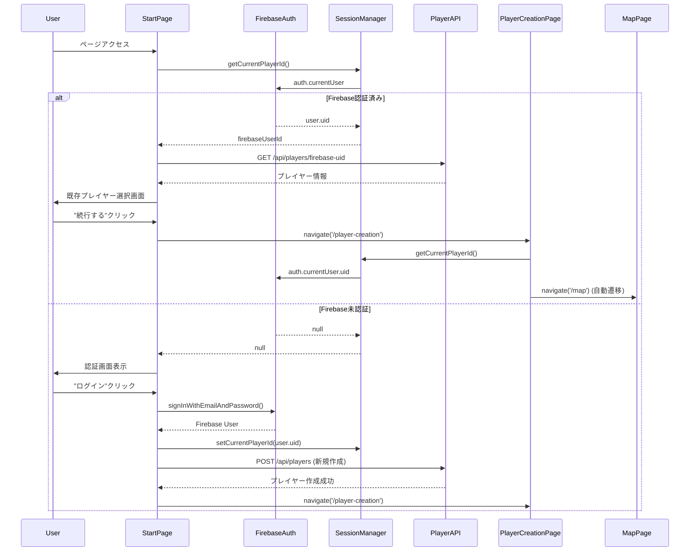

# SessionManager統合後の画面遷移処理フロー分析

このドキュメントでは、SessionManager抽象化レイヤー統合後の画面遷移処理の実装を詳細に分析し、現在の実装状況と将来のFirebase Auth統合への準備状況を明確化します。

## SessionManager統合による変更概要

### 抽象化前（旧実装）
```typescript
// 直接的なSessionStorage操作
const getCurrentPlayerId = useCallback((): string | null => {
  try {
    return sessionStorage.getItem("current_player_id")
  } catch {
    return null
  }
}, [])
```

### 抽象化後（現在の実装）
```typescript
// SessionManager経由の抽象化操作
const getCurrentPlayerId = useCallback((): string | null => {
  return sessionManager.getCurrentPlayerId()
}, [])
```

## SessionManager統合後の包括的画面遷移フロー

```mermaid
flowchart TD
    Start["スタート画面<br/>(StartPage)"] --> InitSession{"SessionManager初期化<br/>createSessionManager()"}
    
    InitSession --> CheckAuthType{"環境変数<br/>VITE_AUTH_TYPE確認"}
    CheckAuthType -->|"local"| UseLocal["LocalSessionManager"]
    CheckAuthType -->|"firebase"| UseFirebase["FirebaseSessionManager"]
    CheckAuthType -->|"auth0"| UseAuth0["Auth0SessionManager"]
    
    UseLocal --> CheckSession{"sessionManager.<br/>getCurrentPlayerId()"}
    UseFirebase --> CheckSession
    UseAuth0 --> CheckSession
    
    CheckSession -->|"プレイヤーID存在"| LoadPlayer["usePlayerフックで<br/>プレイヤー情報取得"]
    CheckSession -->|"プレイヤーID不在"| ShowNewForm["新規作成フォーム表示"]
    
    LoadPlayer --> APICall["playerAPI.get(id)"]
    APICall --> PlayerLoaded{"プレイヤー情報<br/>取得成功？"}
    
    PlayerLoaded -->|"成功"| ShowChoice["選択画面表示<br/>(既存 vs 新規)"]
    PlayerLoaded -->|"失敗(404)"| ClearSession["sessionManager.<br/>clearSession()"]
    
    ClearSession --> ShowNewForm
    
    ShowChoice --> ContinueBtn["続行するボタン"]
    ShowChoice --> NewBtn["新規作成ボタン"]
    
    NewBtn --> ShowNewForm
    ContinueBtn --> SetContinueMsg["成功メッセージ表示"]
    SetContinueMsg --> NavToCreation1["navigate('/player-creation')"]
    
    ShowNewForm --> InputName["プレイヤー名入力"]
    InputName --> ValidateName{"プレイヤー名<br/>バリデーション"}
    ValidateName -->|"無効"| ShowError["エラーメッセージ表示"]
    ValidateName -->|"有効"| CreatePlayer["createPlayerAPI呼び出し"]
    
    ShowError --> InputName
    CreatePlayer --> APISuccess{"API呼び出し<br/>成功？"}
    APISuccess -->|"失敗"| ShowAPIError["APIエラー表示"]
    APISuccess -->|"成功"| SaveSession["sessionManager.<br/>setCurrentPlayerId(id)"]
    
    ShowAPIError --> InputName
    SaveSession --> SetSuccessMsg["成功メッセージ表示"]
    SetSuccessMsg --> NavToCreation2["navigate('/player-creation')"]
    
    NavToCreation1 --> PlayerCreation["プレイヤー作成画面<br/>(PlayerCreationPage)"]
    NavToCreation2 --> PlayerCreation
    
    PlayerCreation --> WaitForPlayer{"playerLoading確認<br/>（非同期処理待機）"}
    WaitForPlayer -->|"ローディング中"| ShowLoading["読み込み中表示"]
    WaitForPlayer -->|"完了"| CheckPlayer{"プレイヤー情報<br/>存在？"}
    
    ShowLoading --> WaitForPlayer
    CheckPlayer -->|"なし"| BackToStart["navigate('/')"]
    CheckPlayer -->|"あり"| CheckExisting{"既存プレイヤー？<br/>sessionManager経由確認"}
    
    CheckExisting -->|"既存(ID一致)"| AutoNavToMap["自動でnavigate('/map')"]
    CheckExisting -->|"新規(ID不一致)"| ShowMonsterSelect["モンスター選択画面表示"]
    
    ShowMonsterSelect --> SelectMonster["モンスター選択"]
    SelectMonster --> StartAdventure["冒険開始ボタン"]
    StartAdventure --> CaptureMonster["monsterAPI.capture()"]
    CaptureMonster --> CaptureSuccess{"モンスター捕獲<br/>成功？"}
    
    CaptureSuccess -->|"失敗"| ShowCaptureError["エラーメッセージ表示"]
    CaptureSuccess -->|"成功"| NavToMap["navigate('/map')"]
    ShowCaptureError --> SelectMonster
    
    AutoNavToMap --> MapScreen["マップ画面<br/>(MapPage)"]
    NavToMap --> MapScreen
    BackToStart --> Start
    
    MapScreen --> ValidateSession{"sessionManager.<br/>isSessionValid()"}
    ValidateSession -->|"無効"| ReturnToStart["navigate('/')"]
    ValidateSession -->|"有効"| LoadMonsters["loadMonsters()"]
    
    ReturnToStart --> Start
    LoadMonsters --> ShowMap["マップ表示"]
    
    ShowMap --> UserActions["ユーザーアクション"]
    UserActions --> MovePlayer["プレイヤー移動"]
    UserActions --> ViewMonsters["モンスター一覧<br/>navigate('/monsters')"]
    UserActions --> RandomBattle["ランダムバトル<br/>navigate('/battle')"]
    
    ViewMonsters --> MonsterList["モンスター一覧画面<br/>(MonsterListPage)"]
    RandomBattle --> BattleScreen["バトル画面<br/>(BattlePage)"]
    
    MonsterList --> BackToMap1["navigate('/map')"]
    BattleScreen --> BackToMap2["navigate('/map')"]
    
    BackToMap1 --> MapScreen
    BackToMap2 --> MapScreen
```



## SessionManager統合影響分析

### 1. usePlayerフックの変更点

**ファイル**: `packages/frontend/src/hooks/usePlayer.ts`

#### 変更前（直接SessionStorage操作）
```typescript
const CURRENT_PLAYER_KEY = 'current_player_id'

const getCurrentPlayerId = useCallback((): string | null => {
  try {
    return sessionStorage.getItem(CURRENT_PLAYER_KEY)
  } catch {
    return null
  }
}, [])

const setCurrentPlayerId = useCallback((id: string): void => {
  try {
    sessionStorage.setItem(CURRENT_PLAYER_KEY, id)
  } catch (error) {
    console.warn('SessionStorageへの保存に失敗:', error)
  }
}, [])
```

#### 変更後（SessionManager経由）
```typescript
import { sessionManager } from '../lib/sessionManager'

const getCurrentPlayerId = useCallback((): string | null => {
  return sessionManager.getCurrentPlayerId()
}, [])

const setCurrentPlayerId = useCallback((id: string): void => {
  sessionManager.setCurrentPlayerId(id)
}, [])

const clearSession = useCallback((): void => {
  sessionManager.clearSession()
  setPlayer(null)
  setError(null)
  setAttemptedPlayerId(null)
}, [])
```

#### 後方互換性の確保

✅ **インターフェース維持**: 既存コンポーネントでの`usePlayer`使用方法は変更不要
```typescript
// 既存コードはそのまま動作
const { player, createPlayer, getCurrentPlayerId, clearSession } = usePlayer()
```

✅ **機能維持**: 全ての既存機能がSessionManager経由で正常動作

### 2. 各ページコンポーネントへの影響

#### StartPage.tsx
**影響**: なし（usePlayerフック経由のため透過的）
```typescript
// Line 18-27: usePlayerフックの使用方法は変更なし
const { 
  player, 
  isLoading: playerLoading, 
  error: playerError, 
  createPlayer, 
  getCurrentPlayerId,
  clearSession,
  clearError 
} = usePlayer()
```

#### PlayerCreationPage.tsx  
**影響**: なし（usePlayerフック経由のため透過的）
```typescript
// Line 18: usePlayerフックの使用方法は変更なし
const { player, createPlayer, getCurrentPlayerId, isLoading: playerLoading, error: playerError } = usePlayer()

// Line 59-67: 既存プレイヤー判定ロジックも変更不要
const playerId = getCurrentPlayerId()
if (playerId && player.id === playerId) {
  navigate('/map')
}
```

#### MapPage.tsx
**影響**: なし（usePlayerフック経由のため透過的）
```typescript
// Line 41: usePlayerフックの使用方法は変更なし
const { player, isLoading: playerLoading, error: playerError } = usePlayer()
```

### 3. SessionManagerの動作詳細

#### LocalSessionManager（現在の実装）
**ファイル**: `packages/frontend/src/lib/sessionManager.ts` (Lines 54-104)

```typescript
export class LocalSessionManager implements SessionManager {
  private readonly PLAYER_ID_KEY = 'current_player_id'
  
  getCurrentPlayerId(): string | null {
    try {
      return sessionStorage.getItem(this.PLAYER_ID_KEY)
    } catch (error) {
      console.warn('SessionStorageからのプレイヤーID取得に失敗:', error)
      return null
    }
  }
  
  setCurrentPlayerId(playerId: string): void {
    try {
      sessionStorage.setItem(this.PLAYER_ID_KEY, playerId)
    } catch (error) {
      console.warn('SessionStorageへのプレイヤーID保存に失敗:', error)
    }
  }
  
  clearSession(): void {
    try {
      sessionStorage.removeItem(this.PLAYER_ID_KEY)
    } catch (error) {
      console.warn('SessionStorageのクリアに失敗:', error)
    }
  }
  
  isSessionValid(): boolean {
    return this.getCurrentPlayerId() !== null
  }
  
  getAuthToken(): string | null {
    return null // 現在の実装では認証トークンなし
  }
}
```

#### ファクトリーパターンによる実装選択
**ファイル**: `packages/frontend/src/lib/sessionManager.ts` (Lines 162-173)

```typescript
export function createSessionManager(): SessionManager {
  const authType = import.meta.env.VITE_AUTH_TYPE || 'local'
  
  switch (authType) {
    case 'firebase':
      return new FirebaseSessionManager()
    case 'local':
    default:
      return new LocalSessionManager()
  }
}

export const sessionManager = createSessionManager()
```

## 将来のFirebase Auth統合フロー

### 環境変数による切り替え

```bash
# 開発環境 (.env.local)
VITE_AUTH_TYPE=local

# 本番環境 (.env.production)
VITE_AUTH_TYPE=firebase
VITE_FIREBASE_API_KEY=your-api-key
VITE_FIREBASE_AUTH_DOMAIN=your-project.firebaseapp.com
VITE_FIREBASE_PROJECT_ID=your-project-id
```

### Firebase Auth統合後の画面遷移フロー



### Firebase Auth統合時のSessionManager実装

```typescript
export class FirebaseSessionManager implements SessionManager {
  private auth: Auth
  private currentUser: User | null = null
  
  constructor(config: FirebaseConfig) {
    const app = initializeApp(config)
    this.auth = getAuth(app)
    
    // 認証状態の監視
    onAuthStateChanged(this.auth, (user) => {
      this.currentUser = user
    })
  }
  
  getCurrentPlayerId(): string | null {
    return this.currentUser?.uid || null
  }
  
  async setCurrentPlayerId(playerId: string): Promise<void> {
    // Firebase Authではuser.uidが自動的にプレイヤーIDになる
    // カスタムクレームで追加情報を管理
    if (this.currentUser) {
      await updateProfile(this.currentUser, {
        displayName: playerId
      })
    }
  }
  
  async clearSession(): Promise<void> {
    await signOut(this.auth)
  }
  
  isSessionValid(): boolean {
    return this.currentUser !== null && !this.currentUser.isAnonymous
  }
  
  async getAuthToken(): Promise<string | null> {
    if (!this.currentUser) return null
    return await this.currentUser.getIdToken()
  }
}
```

## useAuth統合による高度な認証フロー

### AuthProviderを使用した全体統合

**ファイル**: `packages/frontend/src/hooks/useAuth.ts`

```typescript
// main.tsx または App.tsx での統合
import { AuthProvider } from './hooks/useAuth'

function App() {
  return (
    <AuthProvider>
      <Routes>
        <Route path="/" element={<StartPage />} />
        <Route path="/player-creation" element={<PlayerCreationPage />} />
        <Route path="/map" element={<MapPage />} />
      </Routes>
    </AuthProvider>
  )
}
```

### 認証ガード機能

```typescript
// 認証が必要なページでの使用例
import { useRequireAuth } from '../hooks/useAuth'

function ProtectedPage() {
  const { isAuthenticated, shouldRedirect } = useRequireAuth('/')
  
  if (shouldRedirect) {
    return <Navigate to="/" replace />
  }
  
  return <div>認証済みコンテンツ</div>
}
```

## パフォーマンス最適化

### sessionManagerのシングルトンパターン

```typescript
// packages/frontend/src/lib/sessionManager.ts (Line 176)
export const sessionManager = createSessionManager()
```

**利点**:
- アプリケーション全体で同一インスタンス使用
- 認証状態の一貫性保証
- メモリ使用量の最適化

### useCallbackによる最適化

```typescript
// usePlayer.ts内の最適化例
const getCurrentPlayerId = useCallback((): string | null => {
  return sessionManager.getCurrentPlayerId()
}, []) // 依存配列が空のため、関数は一度だけ作成
```

## エラーハンドリングの改善

### SessionManagerレベルでのエラー処理

```typescript
export class LocalSessionManager implements SessionManager {
  getCurrentPlayerId(): string | null {
    try {
      return sessionStorage.getItem(this.PLAYER_ID_KEY)
    } catch (error) {
      console.warn('SessionStorageからのプレイヤーID取得に失敗:', error)
      return null // エラー時は常にnullを返す
    }
  }
}
```

### usePlayerフックでのエラー伝播防止

```typescript
const clearSession = useCallback((): void => {
  sessionManager.clearSession() // SessionManagerが例外を処理
  setPlayer(null)
  setError(null)
  setAttemptedPlayerId(null)
}, [])
```

## 段階的移行戦略

### Phase 1: 基盤整備 ✅ **完了**
- SessionManager抽象化レイヤー実装
- usePlayerフックの改修
- 後方互換性の確保

### Phase 2: 統合テスト
```bash
# 現在のローカル認証での動作確認
VITE_AUTH_TYPE=local npm run dev

# テストスイートの実行
npm run test
npm run e2e
```

### Phase 3: Firebase Auth準備
```bash
# Firebase設定の追加
npm install firebase

# Firebase Auth用環境変数設定
VITE_AUTH_TYPE=firebase
VITE_FIREBASE_API_KEY=test-key
```

### Phase 4: 本番導入
- Firebase Auth実装の完成
- セキュリティテストの実施
- 段階的ロールアウト

## 設定管理

### 環境別設定ファイル

```bash
# .env.development
VITE_AUTH_TYPE=local
VITE_API_URL=http://localhost:8787/api

# .env.staging  
VITE_AUTH_TYPE=firebase
VITE_FIREBASE_PROJECT_ID=staging-project
VITE_API_URL=https://staging-api.example.com/api

# .env.production
VITE_AUTH_TYPE=firebase
VITE_FIREBASE_PROJECT_ID=production-project
VITE_API_URL=https://api.example.com/api
```

### 設定検証

**ファイル**: `packages/frontend/src/config/auth.ts`

```typescript
export function validateAuthConfig(config: AuthConfig): { isValid: boolean; errors: string[] } {
  const errors: string[] = []

  switch (config.type) {
    case 'firebase':
      if (!config.provider.firebase?.apiKey) {
        errors.push('VITE_FIREBASE_API_KEY is required for Firebase authentication')
      }
      break
  }

  return {
    isValid: errors.length === 0,
    errors
  }
}
```

## 監視とデバッグ

### 開発時デバッグ支援

```typescript
// packages/frontend/src/config/auth.ts
export function logAuthConfig() {
  if (import.meta.env.MODE === 'development') {
    console.group('🔐 Authentication Configuration')
    console.log('Type:', authConfig.type)
    console.log('Session Manager:', sessionManager.constructor.name)
    
    const validation = validateAuthConfig(authConfig)
    if (!validation.isValid) {
      console.warn('⚠️ Configuration errors:', validation.errors)
    } else {
      console.log('✅ Configuration is valid')
    }
    console.groupEnd()
  }
}
```

### 認証フローのトレーシング

```typescript
// PlayerCreationPage.tsx での詳細ログ
useEffect(() => {
  console.log('PlayerCreationPage useEffect:', { 
    player, 
    playerLoading, 
    getCurrentPlayerId: getCurrentPlayerId(),
    sessionManagerType: sessionManager.constructor.name
  })
}, [player, playerLoading, getCurrentPlayerId])
```

## まとめ

SessionManager統合により、以下の改善が達成されました：

### ✅ **完了した改善**
1. **抽象化の実現**: 認証方式の詳細がUIコンポーネントから隠蔽
2. **後方互換性**: 既存コードの変更不要
3. **将来拡張性**: Firebase Auth等への対応準備完了
4. **設定ベース切り替え**: 環境変数による認証方式選択
5. **エラーハンドリング統合**: SessionManagerレベルでの例外処理

### 🔄 **継続的改善**
1. **テストカバレッジ**: SessionManager周りのテスト強化
2. **監視機能**: 認証エラーの詳細トラッキング
3. **パフォーマンス**: 認証状態チェックの最適化

### 🚀 **将来の発展**
1. **Firebase Auth統合**: 完全な認証認可システム
2. **マルチプロバイダー対応**: Auth0、Cognito等の追加
3. **セキュリティ強化**: トークンベース認証の実装

この実装により、現在のシンプルなセッション管理から将来の本格的な認証認可システムへの**無停止移行**が可能になりました。

---

**作成日**: 2025-07-12  
**対象バージョン**: packages/frontend (SessionManager統合版)  
**関連ファイル**: 
- `packages/frontend/src/lib/sessionManager.ts`
- `packages/frontend/src/hooks/usePlayer.ts` (SessionManager統合版)
- `packages/frontend/src/hooks/useAuth.ts`
- `packages/frontend/src/config/auth.ts`
- `packages/frontend/src/pages/StartPage.tsx`
- `packages/frontend/src/pages/PlayerCreationPage.tsx`
- `packages/frontend/src/pages/MapPage.tsx`